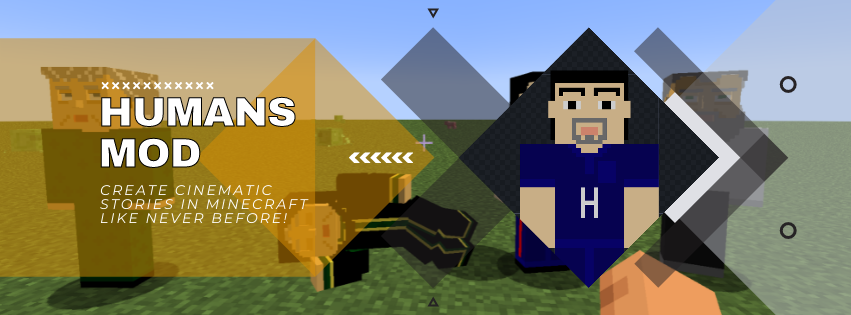

# Humans Mod (Closed-Source)

This is the official page for the **Humans Mod**, a cinematic and machinima-focused Minecraft mod that adds fully controllable, customizable human entities.

📌 This mod is **closed-source** and licensed under a proprietary license.
📥 [Download the latest version on Modrinth](https://modrinth.com/mod/humans)

---

## Features

* Fully controllable human entities
* Easy texture and model switching
* Supports sitting, sleeping, path-walking, and more
* Perfect for roleplays, storytelling, and machinima

---

## Community & Support

Join our community to stay updated, get support, and share your creations!

* **Discord Server:** [Join Our Discord Community!](https://discord.gg/fhKXWN4D)
* **Facebook Page:** [Follow Our Facebook Page!](https://www.facebook.com/profile.php?id=61576926196306)
* **YouTube Channel:** [Subscribe to Our YouTube Channel!](https://www.youtube.com/@humans-mod)

---

## License

See [LICENSE.txt](LICENSE.txt) for full details.

---

## Contact

For permissions, questions, or collaborations, contact: mustafamaxdev@gmail.com

---

## 📚 Documentation

* [v1.0.0 Beta Documentation](docs/v1.0.0-beta.md)
